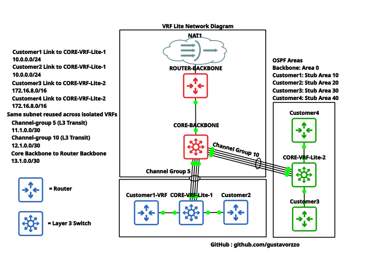

# VRF Lite Network Lab

A hands-on lab project demonstrating **VRF Lite (Virtual Routing and Forwarding)** implementation on a multi-customer network topology, built and tested on GNS3.

---

## 📋 Overview

This project simulates a service provider environment where multiple customers share the same physical infrastructure while maintaining complete **routing table isolation**. Each customer operates in its own VRF, allowing overlapping IP address spaces without conflict.

---

## 🗺️ Topology



### Devices

| Device | Role | OS |
|---|---|---|
| ROUTER-BACKBONE | PE Router — Internet edge | Cisco IOS |
| CORE-BACKBONE | PE Switch — VRF-aware core | Cisco IOS-XE |
| CORE-VRF-Lite-1 | CE Switch — Customer1 & Customer2 | Cisco IOS |
| CORE-VRF-Lite-2 | CE Switch — Customer3 & Customer4 | Cisco IOS |
| Customer1–4 | CE Routers — customer edge | Cisco IOS |

### Addressing

| Link | Subnet |
|---|---|
| Core Backbone → Router Backbone | 13.1.0.0/30 |
| Channel Group 5 (L3 Transit) | 11.1.0.0/30 |
| Channel Group 10 (L3 Transit) | 12.1.0.0/30 |
| Customer1 → CORE-VRF-Lite-1 | 10.0.0.0/24 |
| Customer2 → CORE-VRF-Lite-1 | 10.0.0.0/24 *(reused — isolated VRF)* |
| Customer3 → CORE-VRF-Lite-2 | 172.16.8.0/16 |
| Customer4 → CORE-VRF-Lite-2 | 172.16.8.0/16 *(reused — isolated VRF)* |

### OSPF Areas

| Area | Scope |
|---|---|
| Area 0 (Backbone) | ROUTER-BACKBONE ↔ CORE-BACKBONE |
| Stub Area 10 | Customer1 VRF |
| Stub Area 20 | Customer2 VRF |
| Stub Area 30 | Customer3 VRF |
| Stub Area 40 | Customer4 VRF |

---

## 🔧 Concepts Applied

- **VRF Lite** — per-customer isolated routing tables on a shared L3 infrastructure
- **Overlapping subnets** — same IP ranges reused across isolated VRFs (Customer1/2 and Customer3/4)
- **OSPF Stub Areas** — reduces LSA flooding, injects default route into customer VRFs
- **EtherChannel (L3 Transit)** — Channel Groups 5 and 10 as inter-site L3 trunks
- **NAT at the CE** — each customer handles their own NAT/PAT, keeping the backbone routing-only

---

## 🚀 How to Reproduce

1. Open GNS3 and import the project file from the `gns3/` folder
2. Start all devices
3. Apply configurations from the `configs/` folder to each device
4. Verify VRF isolation:
```
show ip vrf
show ip route vrf <vrf-name>
```
5. Test reachability within each VRF:
```
ping vrf <vrf-name> <destination-ip>
```

---

## 📁 Repository Structure

```
vrf-lite-lab/
├── README.md
├── topology/
│   └── diagram.png
├── configs/
│   ├── router-backbone.txt
│   ├── core-backbone.txt
│   ├── core-vrf-lite-1.txt
│   ├── core-vrf-lite-2.txt
│   ├── customer1.txt
│   ├── customer2.txt
│   ├── customer3.txt
│   └── customer4.txt
└── docs/
    └── design-decisions.md
```

---

## 👤 Author

**Gustavo Rizzo de Freitas**
- GitHub: [@gustavorzzo](https://github.com/gustavorzzo)
- LinkedIn: [gustavorizzo-](https://linkedin.com/in/gustavorizzo-)

---

## 📌 About

This project was built as a personal study lab to deepen understanding of VRF Lite, OSPF design, and service provider network architecture.
